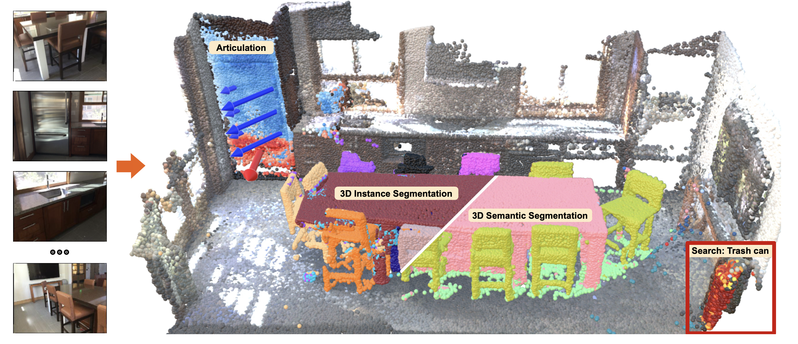

# UNITE 🤝
## Unified Semantic Transformer for 3D Scene Understanding

<a href="https://kochsebastian.com">Sebastian Koch</a>1,2, &nbsp;&nbsp;&nbsp; <a href="https://scholar.google.com/citations?user=dfjN3YAAAAAJ">Johanna Wald</a>2,
&nbsp;&nbsp;&nbsp; <a href="https://muskie82.github.io/">Hide Matsuki</a>2,&nbsp;&nbsp;&nbsp;
 
&nbsp;&nbsp;&nbsp;<a href="https://phermosilla.github.io">Pedro Hermosilla</a>4,&nbsp;&nbsp;&nbsp;<a href="https://scholar.google.com/citations?user=FuY-lbcAAAAJ">Timo Ropinski</a>1,&nbsp;&nbsp;&nbsp;<a href="https://federicotombari.github.io/">Federico Tombari</a>2,4,

1Ulm University&nbsp;&nbsp;&nbsp;&nbsp;2Google&nbsp;&nbsp;&nbsp;&nbsp;3TU Vienna&nbsp;&nbsp;&nbsp;&nbsp;4TU Munich

<h2 class="title is-3">BibTeX</h2>
          <pre><code>
  @article{koch2025unite,
    title={Unified Semantic Transformer for 3D Scene Understanding},
    author={Koch, Sebastian and Wald, Johanna and Matsuki, Hide and Hermosilla, Pedro and Ropinski, Timo and Tombari, Federico},
    journal={arXiv preprint,
    year={2025}
  }
  </code></pre>
    

  

